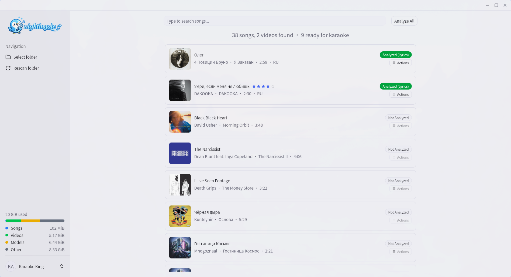

# Configuration

Nightingale stores app settings in `~/.nightingale/config.json`.

## Data Storage

During setup, you can choose a custom data folder. Most runtime data lives in that selected folder. `config.json` and `nightingale.log` remain in the default `~/.nightingale` path.

Typical selected data folder layout:

```
<selected-data-folder>/
├── cache/               # Stems, transcripts, lyrics, shifted variants, covers, playable videos
├── songs.db             # Song library and analysis metadata (SQLite)
├── profiles.json        # Player profiles and scores
├── videos/              # Cached Pixabay video backgrounds
├── sounds/              # Sound effects
├── vendor/
│   ├── ffmpeg           # Downloaded ffmpeg binary
│   ├── uv               # Downloaded uv binary
│   ├── python/          # Python 3.10 installed via uv
│   ├── venv/            # Virtual environment with ML packages
│   ├── analyzer/        # Extracted analyzer Python scripts
│   └── .ready           # Marker indicating setup is complete
└── models/
    ├── torch/           # Demucs model cache
    ├── huggingface/     # WhisperX model cache
    └── audio_separator/ # UVR Karaoke model cache
```

## Video Backgrounds

Pixabay video backgrounds use the [Pixabay API](https://pixabay.com/api/docs/). In development, create a `.env` file at the project root with:

```
PIXABAY_API_KEY=your_key_here
```

## Theme

Toggle between dark and light themes from the sidebar. The theme preference is saved in the config.


