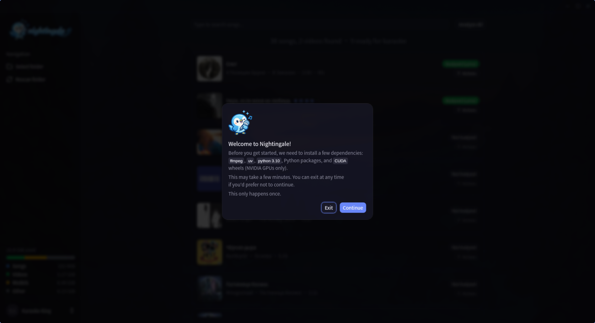
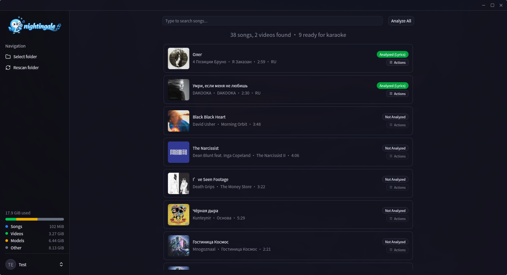

# Getting Started

## Download

| Platform | Format                    | Architectures      |
| -------- | ------------------------- | ------------------- |
| Linux    | `.deb`, `.rpm`, `.tar.xz` | x86_64, ARM (arm64) |
| macOS    | `.dmg`                    | Apple Silicon, Intel |
| Windows  | Installer `.exe`, Portable `.exe`, `.msi` | x86_64 |

<br />

Download the latest version from the [Releases](https://github.com/rzru/nightingale/releases) page.

Supported audio formats: `.mp3`, `.flac`, `.ogg`, `.wav`, `.m4a`, `.aac`, `.wma`.

Supported video formats: `.mp4`, `.mkv`, `.avi`, `.webm`, `.mov`, `.m4v`.

## macOS: Removing the Quarantine Flag

macOS automatically adds a quarantine attribute to files downloaded from the internet. Since Nightingale is not signed with an Apple Developer ID, Gatekeeper will block it with a message like _"app is damaged and can't be opened"_ or _"Apple cannot check it for malicious software"_.

To fix this, remove the quarantine attribute after moving the Nightingale.app to Applications:

```bash
xattr -cr /Applications/Nightingale.app
```

This tells macOS to clear (`-c`) all extended attributes recursively (`-r`) from the app bundle, which removes the `com.apple.quarantine` flag that triggers Gatekeeper. The app itself is safe — it's just not code-signed.

## First Launch

On first launch, Nightingale will guide you through setup:

1. **Choose data folder** — select where cache, models, videos, vendor tools, and the library database are stored
2. **Downloads ffmpeg** — needed for audio/video processing
3. **Downloads uv** — Python package manager
4. **Installs Python 3.10** — via uv, isolated from your system Python
5. **Creates virtual environment** — with PyTorch, WhisperX, Demucs, and UVR models
6. **Downloads ML models** — stem separation and transcription models
7. **Pre-downloads video backgrounds** — Pixabay videos for the first session

This process takes a few minutes and shows a progress screen. After setup completes, Nightingale is ready to use.

<!-- TODO: screenshot of the setup/bootstrap progress screen -->



## Adding Music

When prompted, select your music folder. Nightingale scans it for supported audio and video files. You can change this folder later from the sidebar actions menu.

## Analysis

Before a song can be played as karaoke, it needs to be analyzed:

1. Select a song from the library
2. Analysis runs automatically (stem separation → lyrics → transcription)
3. Results are cached — subsequent plays are instant

You can also batch analysis with **Analyze All** from the song list toolbar.

<!-- TODO: screenshot of the song library with a mix of analyzed/queued/not-analyzed songs -->



## Force Re-setup

If something goes wrong with setup or dependencies, open the sidebar actions menu and select **Re-run Setup**.
